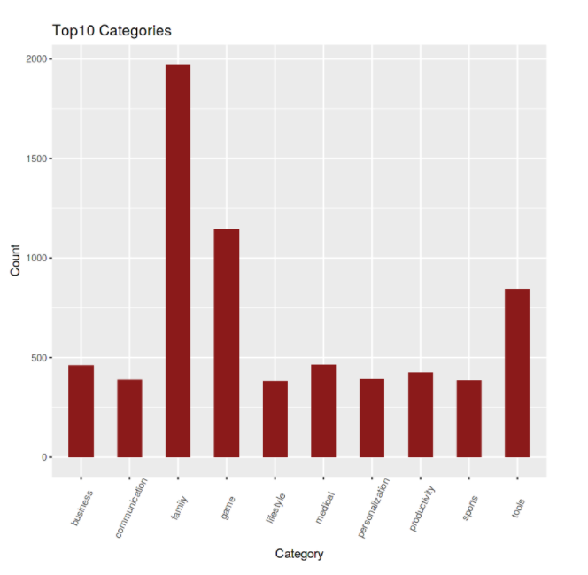
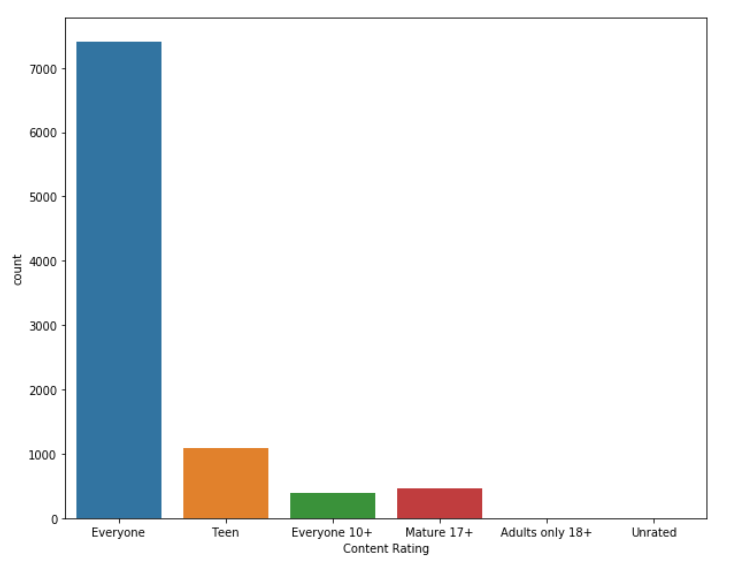

## Google Playstore
The dataset is taken from [Kaggle](https://www.kaggle.com/lava18/google-play-store-apps)

### This notebook covers the cleaning and exploration of data for 'Google Play Store Apps'.

  
  

**Top 10 categories in Google playstore**
## Introduction
**Sentiment Analysis** is a technique used in text mining. It may, therefore, be described as a text mining technique for analyzing the underlying sentiment of a text message, i.e., a tweet. Twitter sentiment or opinion expressed through it may be positive, negative or neutral.

  

 **Content Rating**

In this dataset we have

* `App` : Application name
* `Category` : Category the app belongs to
* `Rating` : Overall user rating of the app
* `Reviews` : Number of user reviews for the app
* `Size` : Size of the app
* `Installs` : Number of user downloads/installs for the app
* `Type` : Paid or Free
* `Price` : Price of the app
* `Content Rating` : Age group the app is targeted at - Children / Mature 21+ / Adult
* `Genres` : An app can belong to multiple genres . For eg, a musical family game will belong to Music, Game, Family genres.
* `Last Updated` : Date when the app was last updated on Play Store
* `Current Ver` : Current version of the app available on Play Store
* `Android Ver` : Min required Android version

Find my code at: <a href="https://github.com/MPrathyusha01/Google-Play-store-analysis"><i class="large github icon"></i>MPrathyusha01/Google-Play-store-analysis</a>

*******
