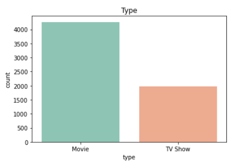
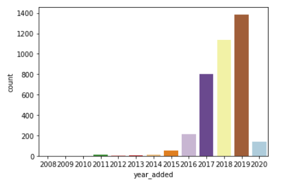
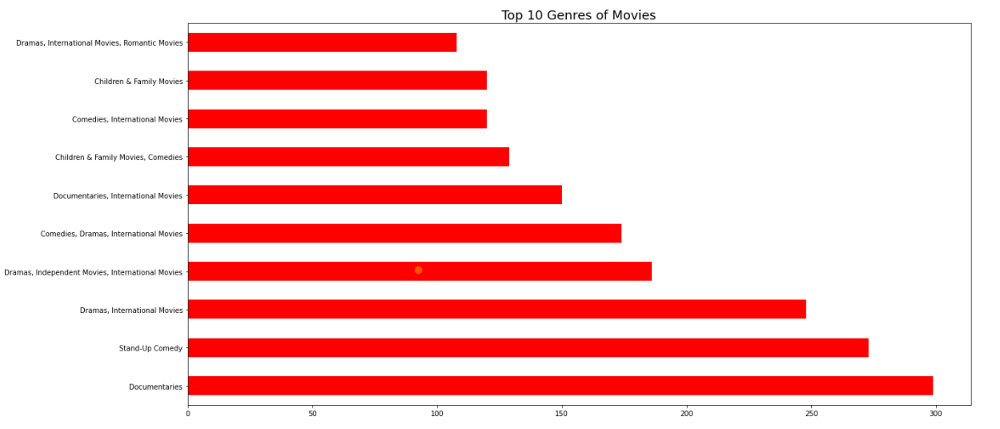
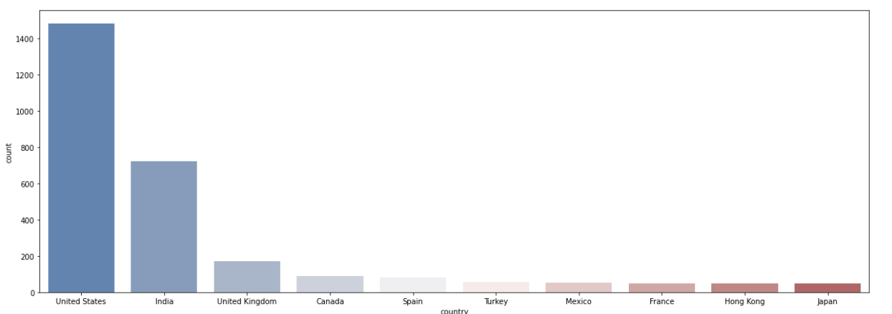

  
  <b>Distribution of Movies and Tv shows in Netflix</b>
  
  <b>No.of movies added in respective year</b>

**Netflix** was developed in 1997 by Reed Hastings and Marc Randolph in Scotts Valley, California. The company's primary business is its subscription-based streaming service which offers online streaming of a library of films and television series, including those produced in-house.Due to the low-price, high-revenue philosophy. Netflix turned out to be an affordable and reliable source of fun for the entire family.

  
  <b>Genere of movies people loves to watch</b>
  
  <b>Name and count of country which watch Netflix most</b>

## Introduction
This dataset consists of tv shows and movies available on Netflix as of 2019. The dataset is collected from Flixable which is a third-party Netflix search engine. The dataset contains 6234 titles (TV Series and Movies) available on Netflix. There are 12 columns related to each title:

* show_id - unique id of the title
* type - type of the title [TV Show, Movie]
* title - title name
* director - director of the movie
* cast - Leads of the title
* country - Country of origin
* date_added - date on which the title was added to Netflix
* release_year - year of release.
* rating - TV-rating
* duration - Runtime of the title (in minutes or seasons)
* listed_in - Genre
* description - short summary of the title

Find my code at: <a href="https://github.com/MPrathyusha01/Netflix-TV-Movies-Analysis"><i class="large github icon"></i>github/mprathyusha01/netflix</a>

*************
