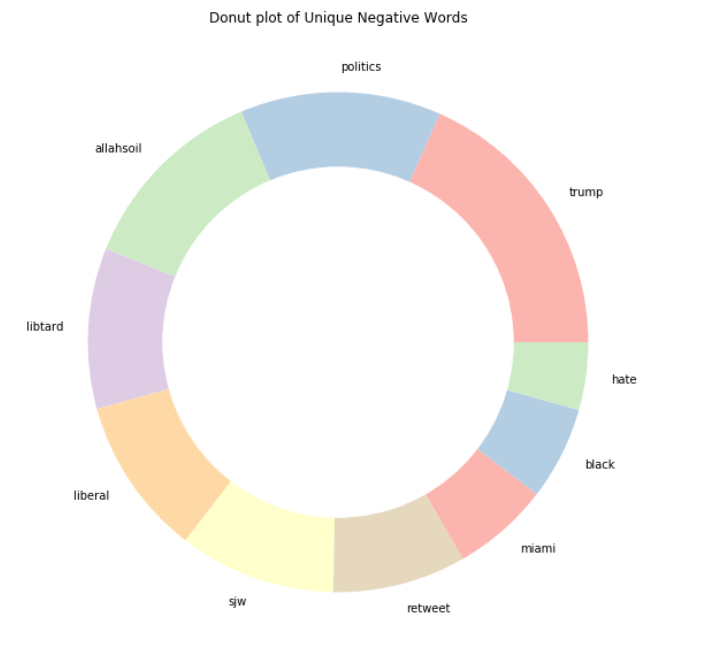
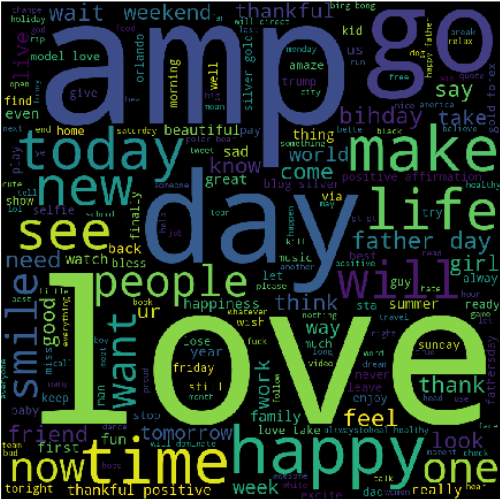
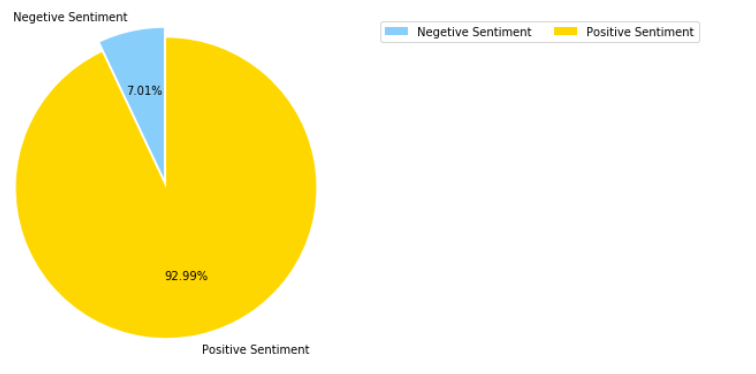

  
  

## Introduction
**Sentiment Analysis** is a technique used in text mining. It may, therefore, be described as a text mining technique for analyzing the underlying sentiment of a text message, i.e., a tweet. Twitter sentiment or opinion expressed through it may be positive, negative or neutral.

  

**The Positive words in Tweets**

As a part of **Natural Language Processing**, algorithms like **Naive Bayes** is used in predicting the polarity of the sentence.

  
  <b>Distribution of Movies and Tv shows in Netflix</b>
 
 
In this hands-on project, we will train a Naive Bayes classifier to predict sentiment from thousands of 
Twitter tweets. This project could be practically used by any company with social media presence to automatically predict customer's sentiment (i.e.: whether their customers are happy or not). The process could be done automatically without having humans manually review thousands of tweets and customer reviews.

  
  <b>Distribution of Movies and Tv shows in Netflix</b>
 
 
 **The Negative words in Tweets**
 
* Import libraries and datasets 
* Perform Exploratory Data Analysis 
* Perform data cleaning - removing punctuation 
* Perform data cleaning - remove stop words 
* Perform Count Vectorization (Tokenization) and TFIDF Vectorization 
* Build the suitable algorithms 
* Assess trained model performance

Find my code at: <a href="https://github.com/MPrathyusha01/Twitter-Sentimental-Analysis-Python"><i class="large github icon"></i>MPrathyusha01/Twitter-Sentimental-Analysis</a>

*******
