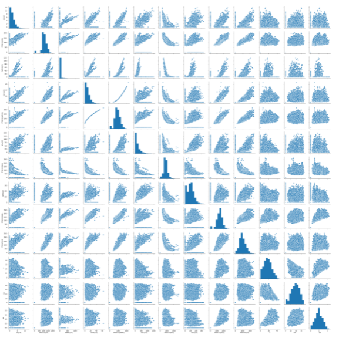
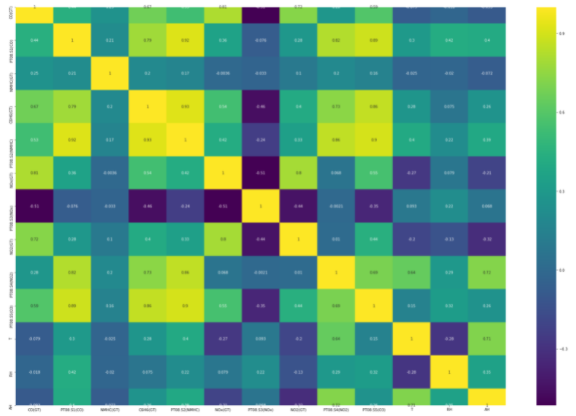

## Air Quality Prediction in Italy (2004 - 2005)
Air quality evaluation is an important way to monitor and control air pollution. The characteristics of air supply affect its suitability for a specific use. A few air pollutants, called criteria air pollutants, are common throughout the United States. These pollutants can injure health, harm the environment and cause property damage.

<div class="ui large rounded images">
  
  
</div>

## Data Set Information

The dataset contains 9358 instances of hourly averaged responses from an array of 5 metal oxide chemical sensors embedded in an Air Quality Chemical Multisensor Device. The device was located on the field in a significantly polluted area, at road level,within an Italian city. Data were recorded from March 2004 to February 2005 (one year)representing the longest freely available recordings of on field deployed air quality chemical sensor devices responses. Ground Truth hourly averaged concentrations for CO, Non Metanic Hydrocarbons, Benzene, Total Nitrogen Oxides (NOx) and Nitrogen Dioxide (NO2) and were provided by a co-located reference certified analyzer. Evidences of cross-sensitivities as well as both concept and sensor drifts are present as described in De Vito et al., Sens. And Act. B, Vol. 129,2,2008 (citation required) eventually affecting sensors concentration estimation capabilities. Missing values are tagged with -200 value.


<div class="ui large rounded images">
  
  
</div>

### Note
* This dataset can be used exclusively for research purposes. Commercial purposes are fully excluded.
* Download dataset[https://archive.ics.uci.edu/ml/machine-learning-databases/00360/AirQualityUCI.zip](here)
 
## Libraries I used 
```
import numpy as np 
import pandas as pd
import matplotlib.pyplot as plt
import seaborn as sns
%matplotlib inline
from sklearn.linear_model import LinearRegression
from sklearn.model_selection import train_test_split
from sklearn.metrics import mean_squared_error, r2_score
import warnings
warnings.filterwarnings("ignore")

```
**Mean squared error: 2.27**
**Coefficient of determination: 0.96**
**R squared value: 0.96**
Source: <a href="https://github.com/MPrathyusha01/Italy-air-pollution"><i class="large github icon "></i>MPrathyusha01/Italy-air-pollution</a>

